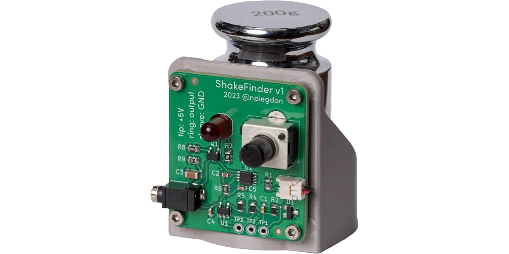

# A low-cost, high-sensitivity vibration sensor

ShakeFinder is based on [David Houlding's](https://davidhoulding.blogspot.com/2014/02/high-sensitivity-vibration-sensor-using.html) vibration sensor with a number of improvements.  The most notable is an open-drain output so it can be connected to non-5V microcontrollers (like Raspberry Pi) easily.

This sensor was created for use with my homemade 8mm film scanner, the [ReelSlow8](https://forums.kinograph.cc/t/the-reelslow8-film-scanner/2491).

Sample code is provided for Arduino Uno.

## Bill of Materials

| Part                               | Value                                        | Package/Notes                                               | Link                                                                                                    |
| ---------------------------------- | -------------------------------------------- | ----------------------------------------------------------- | ------------------------------------------------------------------------------------------------------- |
| Calibration weight                 | 200g                                         | lowest-grade                                                | [Amazon](https://www.amazon.com/dp/B0BLNHJLXJ)                                                          |
| Piezo element                      | 35mm disc                                    | generic                                                     | [Amazon](https://www.amazon.com/dp/B084KHH7B6)                                                          |
| 2x1 PicoBlade connector (optional) | for the piezo element                        | Molex WM1720-ND for connector, 900-0500588020CT-ND for pins |                                                                                                         |
| 2x1 PicoBlade socket (optional)    | for the PCB                                  | Molex WM1742-ND                                             |                                                                                                         |
| 2.5mm TRS jack                     | through-hole, right angle                    | SJ1-2503A                                                   | [DigiKey](https://www.digikey.com/en/products/detail/cui-devices/SJ1-2503A/738680)                      |
| Double-diode                       | ~0.5V drop at no current                     | BAV99, SOT-23                                               | [DigiKey](https://www.digikey.com/en/products/detail/nexperia-usa-inc/BAV99-235/1232158)                |
| front end op-amp                   | Single supply, rail-to-rail, Vss-1 / Vdd+1   | MCP6001T, SOT-23-5                                          | [DigiKey](https://www.digikey.com/en/products/detail/microchip-technology/MCP6001T-I-OT/551760)         |
| Potentiometer                      | Upright, TH, 100k, Log                       | PTV09A-4015U-A104                                           | [DigiKey](https://www.digikey.com/en/products/detail/bourns-inc/PTV09A-4015U-A104/6153483)              |
| Retriggerable Monostable           | SM8 is $0.10 more, but easier to hand-solder | SN74LVC1G123DCTR, 8SSOP (SM8)                               | [DigiKey](https://www.digikey.com/en/products/detail/texas-instruments/SN74LVC1G123DCTR/863597)         |
| Output N-ch FET                    | This one has nice characteristics            | AOSS32136C                                                  | [DigiKey](https://www.digikey.com/en/products/detail/alpha-omega-semiconductor-inc/AOSS32136C/11567433) |
| C1                                 | 10n                                          | 0603 jellybean                                              |                                                                                                         |
| C2                                 | 1u                                           | 0603 jellybean                                              |                                                                                                         |
| C3                                 | 10u                                          | 1206 jellybean                                              |                                                                                                         |
| C5, C4                             | 100n                                         | 0603 jellybean                                              |                                                                                                         |
| D2                                 | red (or whatever)                            | 5mm through-hole jellybean                                  |                                                                                                         |
| R1, R9                             | 100k                                         | 0805 jellybean                                              |                                                                                                         |
| R2, R4, R5                         | 10k                                          | 0805 jellybean                                              |                                                                                                         |
| R7, R8                             | 1k                                           | 0805 jellybean                                              |                                                                                                         |
| R6                                 | Anywhere from 10k to 100k*                   | 0805 jellybean                                              |                                                                                                         |

\* The schematic lists 10k for R6.  The YouTube video demonstrates R6 at 33k.  The value of this resistor controls the length of the pulse.  Using 100k for R6 would cause even less chatter on the output.  Choose whatever you like here.  50k might be a reasonable place to start.